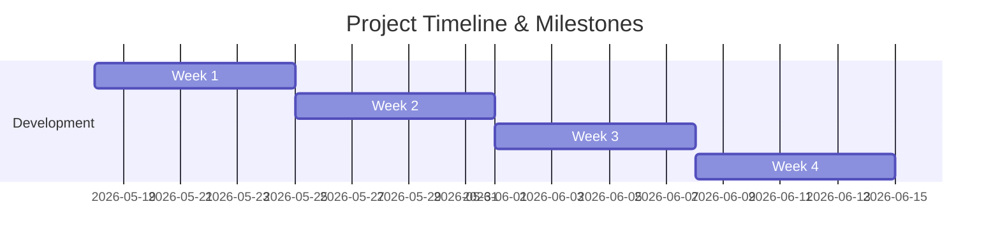

# Project Proposal: Custom Production RAG System for Large-Scale Documents


**Date:** May 17, 2026  
**Status:** Draft  

---

## 1. Executive Summary
Organizations today hold vast amounts of valuable institutional knowledge locked inside unstructured documents (PDFs, DOCs, spreadsheets, and reports). Finding precise information quickly across gigabytes of data is a major operational challenge.

This proposal outlines the implementation of a secure, custom **Retrieval-Augmented Generation (RAG) System**. Unlike standard search tools, this system acts as a highly intelligent corporate assistant. It allows users to ask natural-language questions in both **English and Arabic** and receive accurate, context-aware answers extracted directly from your secure document base, complete with source citations. 

By prioritizing open-source models and serverless hosting architecture, this design delivers **enterprise-grade performance while slashing ongoing infrastructure costs by up to 80%** compared to traditional cloud providers.

---

## 2. Project Objectives
*   **Intelligent Knowledge Retrieval:** Deliver an API that accepts natural language questions and returns direct, synthesized answers backed by exact source citations.
*   **Support for Large-Scale Data:** Safely process and index gigabytes of unstructured documents.
*   **High Performance & Accuracy:** Utilize state-of-the-art multilingual embedding and re-ranking models to ensure relevant context retrieval.
*   **Low Operational Costs:** Implement a serverless GPU execution model that charges only per second of actual use, scaling down to **$0** when idle.
*   **Data Security & Privacy:** Host the entire database and primary API within a dedicated private environment, ensuring corporate files never train public models.

---

## 3. High-Level Technical Architecture
The system consists of two highly optimized pipelines:

```
[Client Applications] ──(HTTPS)──> [FastAPI Gateway] ──(Cache Check)──> [Redis Cache]
                                           │ (Cache Miss)
                                           ├──> [Qdrant Vector DB] (Retrieves source paragraphs)
                                           ├──> [Re-Ranker Model] (Selects top 5 most relevant)
                                           └──> [Ollama / RunPod Serverless] (Generates finalized answer)
```

1.  **Ingestion Pipeline:** Reads, cleanses, chunks, embeds, and stores documents inside a secure, high-performance vector database.
2.  **Query Pipeline (API):** Accepts questions, queries the vector database using semantic search, re-ranks the findings for absolute accuracy, constructs a contextual prompt, and uses a powerful LLM to synthesize the final response.

---

## 4. Scope of Work & Deliverables

The project includes the design, development, deployment, and testing of the following core deliverables:

| Deliverable | Description | Key Features |
| :--- | :--- | :--- |
| **1. FastAPI Gateway** | The central API bridge serving requests. | Secure authentication, request validation, streaming response endpoints (SSE), health checks, auto-generated interactive documentation (Swagger). |
| **2. Secure Database** | A high-performance vector database. | Qdrant containerized deployment, memory-quantized indices to optimize memory usage, support for advanced metadata filtering. |
| **3. Ingestion Engine** | Background document processor. | Supports PDF, Word (DOCX), Excel (XLSX), Markdown, and Plain Text. Handles automatic chunking with 64-token context overlap. |
| **4. Advanced Retrieval** | A state-of-the-art search pipeline. | Semantic embedding (`bge-m3`) coupled with a localized cross-encoder re-ranker to maximize result relevance before LLM synthesis. |
| **5. RunPod Worker** | The LLM execution bridge. | Integration with RunPod Serverless running a 4-bit quantized `Qwen2.5 14B` model, auto-scaling to zero when inactive. |
| **6. Query Cache** | Ultra-fast caching layers. | Redis cache instance implementation. Instantly fulfills repeat or highly similar queries (~50ms response) without invoking GPU costs. |
| **7. Production Deploy** | Complete cloud infrastructure setup. | Automated system orchestration via Docker Compose, private environment isolation, Nginx reverse proxy configuration, and automatic Let's Encrypt SSL management. |

---

## 5. Timeline & Milestones
The complete system is estimated to take **4 Weeks** from initiation to final client handoff.



### Milestone Breakdown
*   **Milestone 1 (End of Week 1): Ingestion Verification**
    *   *Deliverables:* Document loaders built; Qdrant database initialized; sample documents successfully parsed and embedded.
*   **Milestone 2 (End of Week 2): Basic Query Execution**
    *   *Deliverables:* FastAPI live with primary `/ask` endpoint; successful query retrieval and basic response synthesis.
*   **Milestone 3 (End of Week 3): Optimization & Hardening**
    *   *Deliverables:* Re-ranking engine live; Redis cache layer functional; API authentication (API keys) active.
*   **Milestone 4 (End of Week 4): Production Handoff**
    *   *Deliverables:* Infrastructure deployed live on Hetzner & RunPod; full client document database ingested; documentation and testing reports delivered.

---

## 6. Infrastructure & Service Cost Estimates
To maintain full cost control, we use a hybrid hosting model. These are third-party infrastructure fees paid directly to the cloud providers:

| Resource | Service Provider | Estimated Cost (Monthly) | Pricing Model | Rationale |
| :--- | :--- | :--- | :--- | :--- |
| **Host Server** | Hetzner CPX31 | **€13.29** (~$14.50) | Flat Monthly Fee | Hosts FastAPI, Qdrant Vector DB, Redis, and Nginx. Includes 8 GB RAM and 160 GB NVMe storage. |
| **Inference GPU** | RunPod Serverless | **$50.00 – $170.00** | Pay-Per-Second | Runs the LLM only on active requests. Automatically powers down to **$0/hr** when idle. |
| **Data Ingestion** | Hugging Face ZeroGPU | **$0.00** (Free) |  | Free high-speed H200 GPUs utilized for the one-time bulk text embedding process. |
| **SSL & Security** | Cloudflare | **$0.00** (Free) | Free Tier | External domain DNS routing, basic DDoS protection, and SSL certification. |
| **Estimated Total Infrastructure Cost:** | | **~$65.00 – $185.00 / month** | *Dependent on usage volume.* |

---

## 7. Development & Implementation Fee

> [!NOTE]
> The following table represents the professional development, architecture, implementation, and initial support fees associated with executing this project.

| Service Item | Description | Cost |
| :--- | :--- | :--- |
| **RAG System Development & Deployment** | Complete design, scaffolding, API development, integration, optimization, server deployment, and final handoff as defined in the scope of work. | **[Insert Your Development Fee Here]** |
| **Initial Support & Maintenance** | 30 days of post-deployment support, performance monitoring, bug resolution, and client training. | **[Insert Your Support Fee Here (or 'Included')]** |
| **Total Project Cost:** | | **[Insert Total Fee Here]** |


---

## 9. Next Steps
To proceed with this implementation:
1.  **Review and Approve:** Confirm the scope, timeline, and pricing structure outlined in this proposal.
2.  **Kickoff Call:** Schedule a brief meeting to gather initial developer access keys, host credentials, and document formats.
3.  **Mobilization:** Sign the service agreement and finalize the project kickoff schedule.
