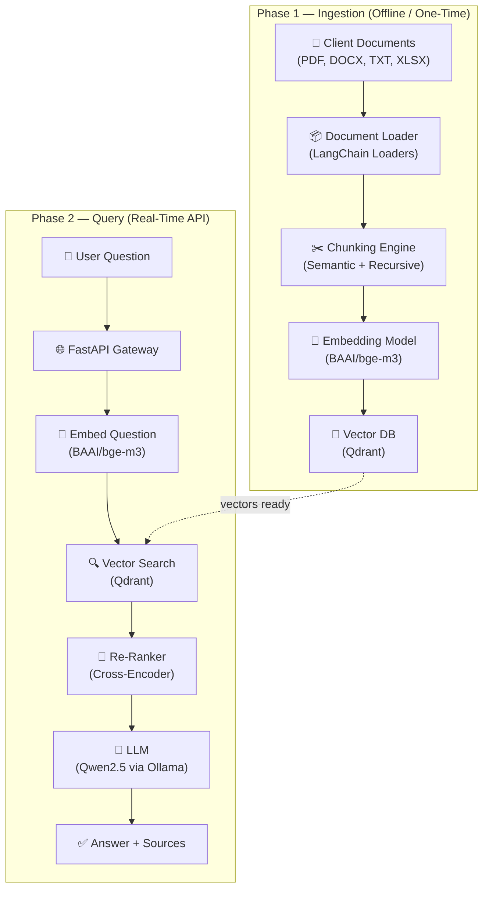
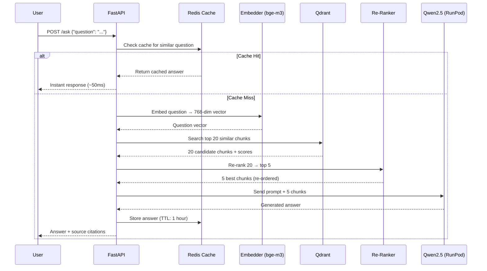

# RAG System — Full Implementation Plan

> **Goal:** Build a production-grade Retrieval-Augmented Generation system that ingests gigabytes of client documents, stores them as vectors, and serves real-time Q&A through an API — all using open-source models, optimized for cost.

---

## 1. Architecture Overview



### Two Distinct Phases

| Phase | When | Duration | GPU Needed? |
|---|---|---|---|
| **Ingestion** | When client delivers docs (or updates) | Hours (one-time) | Optional — CPU works, GPU is 10x faster |
| **Query** | Real-time, whenever users ask questions | Ongoing | **Yes** — LLM inference requires GPU |

---

## 2. Technology Stack — Final Recommendations

### Core Stack

| Layer | Choice | Why This Over Alternatives |
|---|---|---|
| **Language** | Python 3.11+ | Ecosystem dominance for ML/RAG |
| **Framework** | **LangChain** | Mature RAG abstractions, huge community, handles 90% of plumbing |
| **API** | **FastAPI** | Async, fast, auto-generates OpenAPI docs |
| **Embedding Model** | **BAAI/bge-m3** (via HuggingFace) | Best multilingual embedder (Arabic + English), 768-dim, free |
| **Vector DB** | **Qdrant** (self-hosted Docker) | Fastest open-source vector DB, payload filtering, snapshots |
| **LLM** | **Qwen2.5 14B** via **Ollama** | Best open-source model for Arabic+English, runs on 24GB VRAM (Q4) |
| **Re-Ranker** | **BAAI/bge-reranker-v2-m3** | Dramatically improves retrieval accuracy, lightweight |
| **Caching** | **Redis** | Cache frequent queries, reduce GPU costs |
| **Task Queue** | **Celery + Redis** | Background ingestion jobs, progress tracking |

### Why LangChain over LlamaIndex?

| Factor | LangChain | LlamaIndex |
|---|---|---|
| Flexibility | ✅ Build any pipeline shape | ❌ Opinionated index-first approach |
| Document loaders | ✅ 160+ loaders built-in | ⚠️ Fewer, relies on LangChain's |
| Community | ✅ Larger, more examples | ⚠️ Growing but smaller |
| Production readiness | ✅ LangServe for deployment | ⚠️ Less deployment tooling |
| Learning curve | ⚠️ More concepts to learn | ✅ Simpler for basic RAG |

**Verdict:** LangChain — more control, better for a production system you'll need to customize.

---

## 3. Infrastructure & Hosting — Cost-Optimized

### Recommended Setup

```
┌─────────────────────────────────────────────────┐
│  Hetzner VPS (CPX31 — €13.29/mo)                │
│  4 vCPU · 8 GB RAM · 160 GB NVMe                │
│                                                   │
│  ┌──────────────────────────────┐                │
│  │ FastAPI API (port 8000)      │                │
│  │                              │                │
│  │ ┌──────────────────────────┐ │  ┌──────────┐  │
│  │ │ Local Embedder: bge-m3   │ │  │  Qdrant  │  │
│  │ │ (Runs on local CPU/RAM)  │ │  │  (6333)  │  │
│  │ └──────────────────────────┘ │  └──────────┘  │
│  └──────────────┬───────────────┘  ┌──────────┐  │
│                 │                  │  Redis   │  │
│                 │                  │  (6379)  │  │
│                 │                  └──────────┘  │
│  Nginx reverse proxy + Let's Encrypt SSL         │
└─────────────────┼───────────────────────────────┘
                  │ HTTPS
                  ▼
┌─────────────────────────────────────────────────┐
│  RunPod Serverless (pay-per-second)              │
│  RTX 4090 · 24 GB VRAM · ~$0.00031/sec          │
│                                                   │
│  ┌──────────────────────────┐                    │
│  │  Ollama + Qwen2.5 14B   │                    │
│  │  (Serverless Endpoint)   │                    │
│  └──────────────────────────┘                    │
│  Scales to ZERO when idle — no charges!          │
└─────────────────────────────────────────────────┘
```

### Cost Breakdown

| Component | Provider | Monthly Cost | Notes |
|---|---|---|---|
| **API + Qdrant + Redis** | Hetzner CPX31 | **€13.29** (~$14) | 8 GB RAM handles ~2M vectors comfortably |
| **LLM Inference** | RunPod Serverless | **$50–$170** | Depends on usage (scales to zero when idle) |
| **Embeddings (ingestion)** | HuggingFace ZeroGPU | **$0** (free) | H200 GPU, perfect for one-time batch jobs |
| **Domain + SSL** | Cloudflare | **$0** | Free tier + Let's Encrypt |
| **Monitoring** | Uptime Kuma (self-hosted) | **$0** | Runs on same Hetzner VPS |
| | | | |
| **Total (light use)** | | **~$65/month** | Client using it a few hours/day |
| **Total (heavy use)** | | **~$185/month** | 8+ hours/day active queries |

### GPU Provider Comparison (for reference)

| Provider | GPU | VRAM | $/hr | Best For |
|---|---|---|---|---|
| **RunPod Serverless** | RTX 4090 | 24 GB | $0.69 | ✅ Production API (scales to zero) |
| **RunPod On-Demand** | A100 80GB | 80 GB | $1.39 | Heavy workloads, large models |
| **Vast.ai** | RTX 4090 | 24 GB | $0.30 | ✅ One-time ingestion (cheapest) |
| **Lambda Labs** | A100 80GB | 80 GB | $1.29 | Persistent server, no egress fees |
| **HuggingFace** | L40S | 48 GB | $1.80 | Managed, no DevOps needed |

> [!TIP]
> **RunPod Serverless is the key cost saver.** Unlike on-demand instances that charge 24/7, serverless charges per-second of actual compute. If your client's team only asks questions during business hours, you pay for those hours only — and $0 overnight.

---

## 4. Project Structure

```
Rag_project_software/
├── README.md
├── .env.example                  # Environment variables template
├── .gitignore
├── docker-compose.yml            # Full stack orchestration
├── Dockerfile                    # FastAPI app container
├── requirements.txt              # Python dependencies
│
├── app/                          # FastAPI Application
│   ├── __init__.py
│   ├── main.py                   # FastAPI app entry point
│   ├── config.py                 # Settings & environment config
│   ├── models.py                 # Pydantic request/response schemas
│   │
│   ├── api/                      # API Routes
│   │   ├── __init__.py
│   │   ├── routes_query.py       # POST /ask, POST /ask/stream
│   │   ├── routes_ingest.py      # POST /ingest, GET /ingest/status
│   │   └── routes_health.py      # GET /health, GET /health/detailed
│   │
│   ├── core/                     # RAG Core Logic
│   │   ├── __init__.py
│   │   ├── embedder.py           # Embedding model wrapper
│   │   ├── vector_store.py       # Qdrant operations (CRUD, search)
│   │   ├── retriever.py          # Retrieval + re-ranking pipeline
│   │   ├── llm_client.py         # Ollama / RunPod API client
│   │   └── rag_chain.py          # Full RAG chain orchestration
│   │
│   ├── ingestion/                # Document Processing Pipeline
│   │   ├── __init__.py
│   │   ├── loader.py             # Multi-format document loaders
│   │   ├── chunker.py            # Chunking strategies
│   │   ├── processor.py          # Full ingestion pipeline
│   │   └── tasks.py              # Celery async tasks
│   │
│   └── utils/                    # Shared Utilities
│       ├── __init__.py
│       ├── cache.py              # Redis caching layer
│       ├── logger.py             # Structured logging
│       └── metrics.py            # Performance tracking
│
├── scripts/                      # Operational Scripts
│   ├── ingest_documents.py       # CLI tool to run ingestion
│   ├── benchmark.py              # Test retrieval quality
│   └── runpod_scheduler.py       # Start/stop GPU on schedule
│
├── tests/                        # Test Suite
│   ├── test_chunker.py
│   ├── test_retriever.py
│   ├── test_rag_chain.py
│   └── test_api.py
│
├── documents/                    # Client documents (gitignored)
│   └── .gitkeep
│
└── nginx/                        # Reverse Proxy Config
    └── default.conf
```

---

## 5. Ingestion Pipeline — Detailed Design

### Document Loading (Multi-Format)

```python
# Supported formats and their loaders
LOADERS = {
    ".pdf":  PyPDFLoader,           # Most common
    ".docx": Docx2txtLoader,        # Microsoft Word
    ".txt":  TextLoader,            # Plain text
    ".xlsx": UnstructuredExcelLoader,# Spreadsheets
    ".csv":  CSVLoader,             # CSV data
    ".html": BSHTMLLoader,          # Web pages
    ".md":   UnstructuredMarkdownLoader,  # Markdown
}
```

### Chunking Strategy (Critical for Quality)

| Strategy | Use When | Chunk Size |
|---|---|---|
| **RecursiveCharacterTextSplitter** | Default, works for most docs | 512 tokens |
| **SemanticChunker** | Long-form reports, legal docs | Variable (by meaning) |
| **MarkdownHeaderTextSplitter** | Structured markdown docs | By section |

> [!IMPORTANT]
> **Chunking is the #1 factor that determines answer quality.** Bad chunks = bad retrieval = bad answers, regardless of how good your LLM is. The default 512-token recursive split with 64-token overlap works for 80% of cases.

### Metadata Enrichment

Every chunk gets tagged with:
- `source_file` — which document it came from
- `page_number` — for PDFs
- `chunk_index` — position in the document
- `file_type` — PDF, DOCX, etc.
- `ingested_at` — timestamp
- `client_id` — if serving multiple clients

This enables **filtered search** — "search only in financial reports" or "only docs from 2024."

### Batch Processing for GBs of Data

```python
# Process in batches to handle memory
BATCH_SIZE = 256  # Embed 256 chunks at a time

for i in range(0, len(chunks), BATCH_SIZE):
    batch = chunks[i:i + BATCH_SIZE]
    embeddings = embedder.encode([c.page_content for c in batch])
    qdrant_client.upsert(
        collection_name="documents",
        points=[...zip(embeddings, batch)...]
    )
    logger.info(f"Processed {i + BATCH_SIZE}/{len(chunks)} chunks")
```

---

## 6. Query Pipeline — Detailed Design

### The Full Query Flow



### Why Re-Ranking Matters

Vector search finds chunks that are **semantically similar** to the question, but similarity ≠ relevance. A re-ranker (cross-encoder) reads the question AND each chunk together and scores actual relevance.

| Without Re-Ranker | With Re-Ranker |
|---|---|
| Top 5 from vector search | Top 20 from vector search → re-ranked to top 5 |
| ~65% relevant chunks | ~90% relevant chunks |
| LLM gets some noise | LLM gets precise context |
| Okay answers | **Significantly better answers** |

### Prompt Engineering

```python
SYSTEM_PROMPT = """You are a helpful document assistant. Answer questions 
using ONLY the provided context. If the context doesn't contain enough 
information to answer, say "I don't have enough information to answer this."

Rules:
- Be precise and cite which document the information comes from
- If multiple documents discuss the topic, synthesize the information
- Never make up information not present in the context
- Respond in the same language the question was asked in"""

USER_PROMPT = """Context (from client documents):
---
{context}
---

Question: {question}

Provide a clear, detailed answer with source references."""
```

---

## 7. Deployment Strategy

### Docker Compose (Full Stack)

```yaml
# docker-compose.yml
version: "3.8"

services:
  api:
    build: .
    ports: ["8000:8000"]
    env_file: .env
    depends_on:
      qdrant:
        condition: service_healthy
      redis:
        condition: service_healthy
    restart: unless-stopped

  qdrant:
    image: qdrant/qdrant:latest
    ports: ["6333:6333"]
    volumes:
      - qdrant_data:/qdrant/storage
    environment:
      QDRANT__SERVICE__GRPC_PORT: 6334
    healthcheck:
      test: ["CMD", "curl", "-f", "http://localhost:6333/healthz"]
      interval: 10s
      timeout: 5s
      retries: 3
    restart: unless-stopped

  redis:
    image: redis:7-alpine
    ports: ["6379:6379"]
    volumes:
      - redis_data:/data
    healthcheck:
      test: ["CMD", "redis-cli", "ping"]
      interval: 10s
      timeout: 5s
      retries: 3
    restart: unless-stopped

volumes:
  qdrant_data:
  redis_data:
```

### Deployment Steps

1. **Provision Hetzner CPX31** → Install Docker + Docker Compose
2. **Clone repo** → `git clone` + `docker compose up -d`
3. **Configure Nginx** → Reverse proxy + SSL via Certbot
4. **Set up RunPod Serverless** → Deploy Ollama + Qwen2.5 endpoint
5. **Run ingestion** → Upload client docs → `python scripts/ingest_documents.py`
6. **Test API** → `curl -X POST https://your-domain.com/ask -d '{"question": "..."}'`

---

## 8. Scale Considerations for Gigabytes of Data

| Document Scale | Vectors | RAM (Qdrant) | Server | Ingestion Time |
|---|---|---|---|---|
| 1–2 GB | ~500K | ~1.5 GB | CPX31 (8 GB) ✅ | ~2 hours |
| 5–10 GB | ~2M | ~6 GB | CPX31 (8 GB) ✅ | ~6 hours |
| 20–50 GB | ~8M+ | ~24 GB | CPX41 (16 GB) or dedicated | ~24 hours |
| 100 GB+ | ~30M+ | ~90 GB | Dedicated server | Multi-day |

> [!WARNING]
> If the client's documents exceed **20 GB**, the CPX31 won't have enough RAM for Qdrant. Upgrade to CPX41 (16 GB, ~€26/mo) or enable Qdrant's **on-disk** index mode which trades speed for memory savings.

### Performance Optimizations

1. **HNSW Index Tuning** — Qdrant's default HNSW `m=16, ef_construct=100` is good. For >5M vectors, increase `ef_construct=200` for better recall.
2. **Quantization** — Enable Qdrant's built-in scalar quantization to cut memory usage by 4x with minimal quality loss.
3. **Batch Embedding** — Process 256 chunks per batch on GPU, not one at a time.
4. **Connection Pooling** — Use `httpx.AsyncClient` with connection pooling for Ollama/RunPod calls.
5. **Streaming Responses** — Stream LLM output to the client via Server-Sent Events for perceived speed.

---

## 9. Implementation Timeline

### Phase 1 — Foundation (Week 1)
- [ ] Set up project structure and dependencies
- [ ] Implement document loaders (PDF, DOCX, TXT, XLSX)
- [ ] Build chunking engine with configurable strategies
- [ ] Set up Qdrant (Docker) and test vector operations
- [ ] Implement embedding pipeline with BAAI/bge-m3

### Phase 2 — Query Pipeline (Week 2)
- [ ] Build FastAPI endpoints (`/ask`, `/health`, `/ingest`)
- [ ] Implement RAG chain (embed → search → re-rank → LLM)
- [ ] Integrate Ollama client (local dev) + RunPod client (production)
- [ ] Add Redis caching for frequent queries
- [ ] Build streaming response support (SSE)

### Phase 3 — Production Hardening (Week 3)
- [ ] Docker Compose for full stack
- [ ] Nginx reverse proxy + SSL
- [ ] Deploy to Hetzner VPS
- [ ] Set up RunPod Serverless endpoint
- [ ] Add structured logging and error handling
- [ ] Write integration tests

### Phase 4 — Polish & Handoff (Week 4)
- [ ] Run full ingestion on client documents
- [ ] Benchmark retrieval quality and tune parameters
- [ ] Add API authentication (API keys)
- [ ] Write API documentation
- [ ] Create client-facing usage guide
- [ ] Set up monitoring (Uptime Kuma, basic alerts)

---

## 10. Decisions Needed From You

Before I start writing code, I need your input on these:

| # | Question | Options | My Recommendation |
|---|---|---|---|
| 1 | **How many GBs of documents?** | Rough estimate | Affects server sizing |
| 2 | **Document formats?** | PDF, DOCX, TXT, XLSX, other? | Need to know which loaders to build |
| 3 | **Languages?** | Arabic, English, mixed? | Affects embedding & LLM model choice |
| 4 | **Multi-tenant?** | One client or multiple clients? | Affects data isolation design |
| 5 | **Auth needed?** | API keys, OAuth, none? | API keys are simplest to start |
| 6 | **Budget ceiling?** | Monthly limit? | Determines GPU tier |
| 7 | **Start building now?** | Full stack or piece by piece? | I can scaffold everything today |

---

> [!NOTE]
> This plan is designed to be **modular** — each component can be swapped. Don't like Qdrant? Swap for pgvector. Client needs a bigger model? Swap Qwen2.5 14B for 32B and upgrade the GPU. The architecture stays the same.
